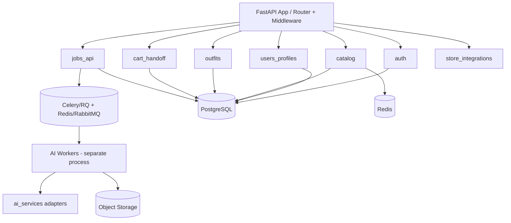

# Backend Architecture

## 1. Framework decision
**Python + FastAPI**. Rationale: async performance, first-class fit with the AI/ML ecosystem (same language as models/orchestration), fast developer velocity, strong typing via Pydantic. See `engineering/tech-stack.md`.

**Modular monolith first, extract services later.** A small team should NOT start with microservices. One deployable FastAPI app with clear module boundaries; extract the GPU/AI workers (already separate) and later split only where scale demands.

## 2. Module boundaries (within the monolith)

## 3. Layered structure per module
`router (HTTP) → service (business logic) → repository (data) → models (SQLAlchemy) + schemas (Pydantic)`. Dependencies point inward; services are unit-testable without HTTP.

## 4. Async job processing
- **Queue:** Celery (mature) or RQ (simpler) over **Redis** (MVP) → **RabbitMQ/Kafka** if fan-out/throughput grows.
- **Workers:** separate GPU-capable processes running the AI pipeline; scale independently of the API.
- **Idempotency:** jobs keyed by content hash (avatar_id + item-set) → cache/reuse identical renders (major cost saver).
- **Status:** job records in Postgres; push via FCM + poll endpoint.

## 5. API surface (see `engineering/api-design.md` for detail)
`/auth · /users · /profiles/body · /catalog · /outfits · /tryon (jobs) · /fit · /cart · /stores · /events`. Versioned under `/v1`.

## 6. AI service abstraction
Backend never calls a model directly — it calls an **AI service interface** (`BodyModelService`, `TryOnService`, `FitService`, `OutfitService`) with a **hosted adapter**, a **self-hosted adapter**, and a **mock adapter**. Swappable via config. Detail in `architecture/ai-architecture.md`.

## 7. Data stores
| Store | Use |
|---|---|
| **PostgreSQL** | Users, profiles, consent, products (normalized cache), outfits, jobs, fit reports, carts, audit |
| **Redis** | Cache (catalog, sessions), queue broker, rate-limit counters |
| **Object storage (S3/R2)** | Photos, avatars, render sets (encrypted, lifecycle policies) |
| **Vector DB (optional, V2)** | Outfit/style embeddings for recommendations (pgvector first) |

## 8. Cross-cutting
- **AuthN/Z:** JWT access + refresh; role/scope; per-route guards.
- **Validation:** Pydantic on all inputs; strict image validation on uploads.
- **Rate limiting:** per-user + per-IP at gateway/middleware.
- **Observability:** structured JSON logs, OpenTelemetry traces, Sentry errors, **cost-per-inference metric**.
- **Config/secrets:** env + secrets manager; `.env.example` for local.
- **Migrations:** Alembic.

## 9. Why not Go/Node for the core?
Go/Node are excellent for high-throughput I/O, but the **AI orchestration, model glue, and data-science iteration** all live in Python. Keeping one language reduces context-switching for a small team. If a specific ultra-high-QPS edge service emerges (e.g., the deep-link/attribution service), it can be a small Go service later. Decision logged in `DECISION_LOG.md`.

## 10. Scaling path
Modular monolith → extract AI workers (already separate) → extract catalog/search under load → introduce Kafka if event volume warrants → multi-region for data residency (DPDP) if required.
