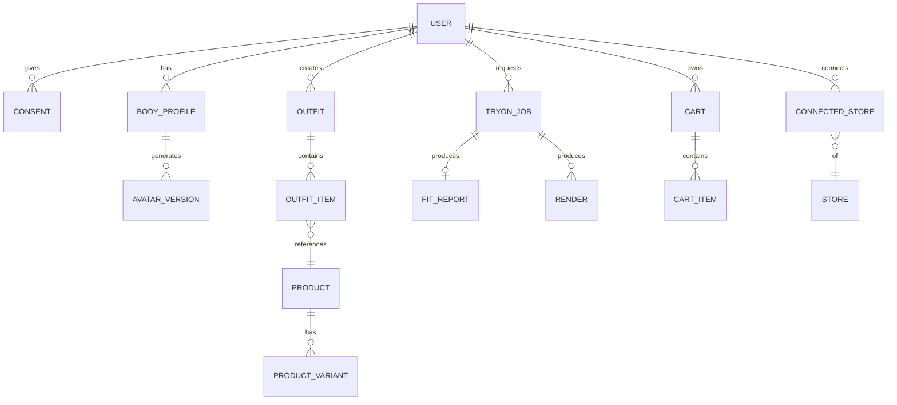
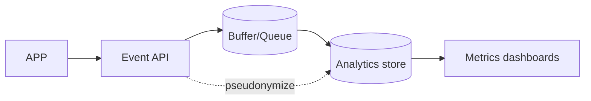

# Data Architecture

## 1. Data stores & roles
| Store | Role | Notes |
|---|---|---|
| **PostgreSQL** | System of record | Users, consent, profiles, products(cache), outfits, jobs, fit reports, carts, audit |
| **Redis** | Cache + queue | Catalog cache, sessions, rate-limit, job broker |
| **Object storage (S3/Cloudflare R2)** | Binary assets | Photos, avatars, render sets — **encrypted, lifecycle-managed** |
| **pgvector (V2)** | Embeddings | Outfit/style similarity for recommendations |

## 2. Core entities (ER overview)

## 3. Key tables (selected columns)
**users** (id, email, phone, auth_provider, created_at, status)
**consents** (id, user_id, type[processing|storage|model_improvement|transfer], granted, version, ts) — *auditable, versioned*
**body_profiles** (id, user_id, height_cm, weight_kg?, posture, status, created_at, deleted_at) — soft-delete for DPDP
**avatar_versions** (id, body_profile_id, smpl_params_ref, skin_tone, mesh_ref, confidence, created_at)
**products** (id, store_id, external_id, title, brand, category, price, currency, sizes_json, colors_json, availability, size_chart_json?, deep_link_tmpl, affiliate_params_json, fetched_at) — normalized cache
**product_variants** (id, product_id, size, color, sku, price, availability)
**outfits** (id, user_id, name, created_at) · **outfit_items** (id, outfit_id, product_id, variant_id?, category)
**tryon_jobs** (id, user_id, avatar_id, item_set_hash, status, cost, latency_ms, created_at) — *item_set_hash enables render reuse*
**renders** (id, job_id, angle, storage_ref, resolution)
**fit_reports** (id, job_id, regions_json, score, confidence, recommendations_json)
**carts** (id, user_id) · **cart_items** (id, cart_id, product_id, variant_id, store_id, added_at)
**connected_stores** (id, user_id, store_id, capability_snapshot_json, connected_at)
**fit_feedback** (id, user_id, product_id, purchased_size, fit_accurate_bool, notes) — *moat dataset*
**audit_log** (id, actor, action, entity, ts, meta) — security/compliance

## 4. Data classification & handling
| Class | Examples | Handling |
|---|---|---|
| **Sensitive (body/biometric-like)** | photos, avatars, measurements | Encrypted at rest; access-controlled; short retention; deletable; region-appropriate; **no training w/o opt-in** |
| **Personal** | email, phone | Encrypted; DPDP rights honored |
| **Operational** | products, outfits, jobs | Standard protection |
| **Analytics** | events | Pseudonymized/aggregated |

## 5. Retention policy (see `compliance/privacy.md`)
| Data | Default retention |
|---|---|
| Uploaded photos | Deleted after avatar generation OR short window (user-set), unless user opts to keep |
| Avatars | Kept while account active; deletable |
| Renders | Cache TTL; regenerable |
| Fit feedback | Retained (consented) for model improvement — anonymizable |
| Audit logs | As required by security/compliance |

## 6. Caching strategy
- **Catalog:** Redis TTL per feed refresh cadence; stale-while-revalidate.
- **Renders:** object storage keyed by `item_set_hash + avatar_id` → dedupe identical requests.
- **Sessions/rate-limit:** Redis.

## 7. Migrations & integrity
Alembic migrations, FK constraints, soft-deletes for user-erasable data, `deleted_at` filters, and a **hard-delete job** honoring DPDP erasure within SLA.

## 8. Analytics data flow

Events are privacy-safe (no raw body data); metrics defined in `diagrams/` and the metrics section of the master document.
