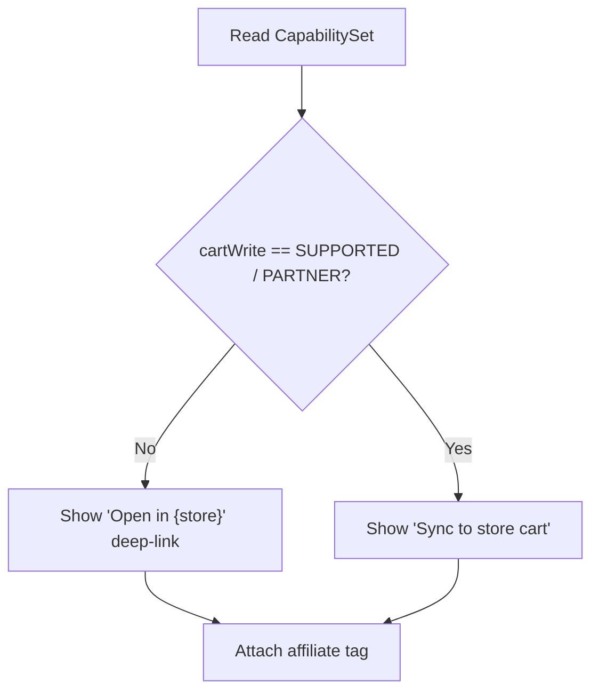
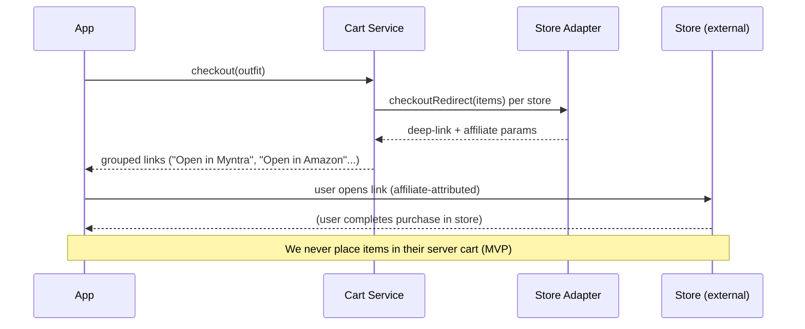

# Integration Architecture (Store Adapters)

> The most business-critical architecture in the repo. It encodes the platform reality from `research/platform-api-research.md` into code structure, so the product **degrades gracefully** and never promises what a platform can't deliver.

## 1. The core abstraction
Every store is a `StoreIntegration` implementation that **declares its capabilities**. The app reads the capability set and adapts the UI.

```mermaid
flowchart LR
    APP[App / Catalog Service] --> REG[Adapter Registry]
    REG --> A1[AmazonAdapter]
    REG --> A2[AffiliateFeedAdapter\n(Myntra/Ajio/Flipkart/Nykaa)]
    REG --> A3[MeeshoAdapter]
    REG --> A4[PartnerAdapter (future)]
    A1 --> CAP1{{CapabilitySet}}
    A2 --> CAP2{{CapabilitySet}}
    A4 --> CAP4{{CapabilitySet}}
```

## 2. Interface (language-agnostic contract)
```
interface StoreIntegration:
    capabilities() -> CapabilitySet
    authenticate(ctx) -> AuthResult            # most: UNSUPPORTED
    getProducts(query) -> [Product]            # PA-API / affiliate feed
    getProductDetails(id) -> ProductDetail
    getVariants(id) -> [Variant]
    getCart(user) -> Cart                       # most: UNSUPPORTED
    addToCart(user, item) -> Result             # most: internal-only
    updateCart(user, item) -> Result
    removeFromCart(user, item) -> Result
    checkoutRedirect(items) -> DeepLink         # SUPPORTED everywhere (affiliate)
```

## 3. CapabilitySet (per-store truth table)
```
CapabilitySet {
  catalog:        FEED | API | NONE
  auth:           OAUTH | NONE
  cartRead:       SUPPORTED | UNSUPPORTED
  cartWrite:      SUPPORTED | PARTNER_ONLY | UNSUPPORTED
  checkout:       DEEPLINK | PARTNER | NONE
  attribution:    AFFILIATE | NONE
}
```

### Declared capabilities (from platform research)
| Store | catalog | auth | cartRead | cartWrite | checkout | attribution |
|---|---|---|---|---|---|---|
| Amazon | API (PA-API, constrained) | NONE* | UNSUPPORTED | UNSUPPORTED | DEEPLINK | AFFILIATE |
| Myntra | FEED (network) | NONE | UNSUPPORTED | UNSUPPORTED | DEEPLINK | AFFILIATE |
| Ajio | FEED | NONE | UNSUPPORTED | UNSUPPORTED | DEEPLINK | AFFILIATE |
| Flipkart | FEED | NONE | UNSUPPORTED | UNSUPPORTED | DEEPLINK | AFFILIATE |
| Nykaa Fashion | FEED | NONE | UNSUPPORTED | UNSUPPORTED | DEEPLINK | AFFILIATE |
| Meesho | FEED (limited) | NONE | UNSUPPORTED | UNSUPPORTED | DEEPLINK | AFFILIATE(?) |
| Partner (future) | API | OAUTH | PARTNER_ONLY | PARTNER_ONLY | PARTNER | AFFILIATE |

\* Login-with-Amazon exists but does not grant shopping-cart access.

## 4. UI adaptation rules


## 5. Product normalization
Adapters map heterogeneous store data → a **canonical `Product`** (see `architecture/data-architecture.md`): id, store, title, brand, category, images[], price, currency, sizes[], colors[], availability, sizeChart?, deepLinkTemplate, affiliateParams. Missing fields are explicit `null`, never faked.

## 6. Handoff / affiliate flow


## 7. Failure & degradation
| Failure | Behavior |
|---|---|
| Feed stale/unavailable | Serve cached catalog + "prices may vary" note |
| Product delisted | Mark unavailable; suggest similar |
| Adapter error | Isolate to that store; others keep working |
| Rate limit (PA-API) | Backoff + cache; degrade gracefully |

## 8. Future partner integration path
When a partnership lands: implement `PartnerAdapter` with real `auth=OAUTH`, `cartWrite=PARTNER_ONLY`, `checkout=PARTNER`. **Zero changes** to the app UI logic — it already reads capabilities. This is the payoff of the abstraction: cart-sync becomes a config+adapter drop-in, not a rewrite.
