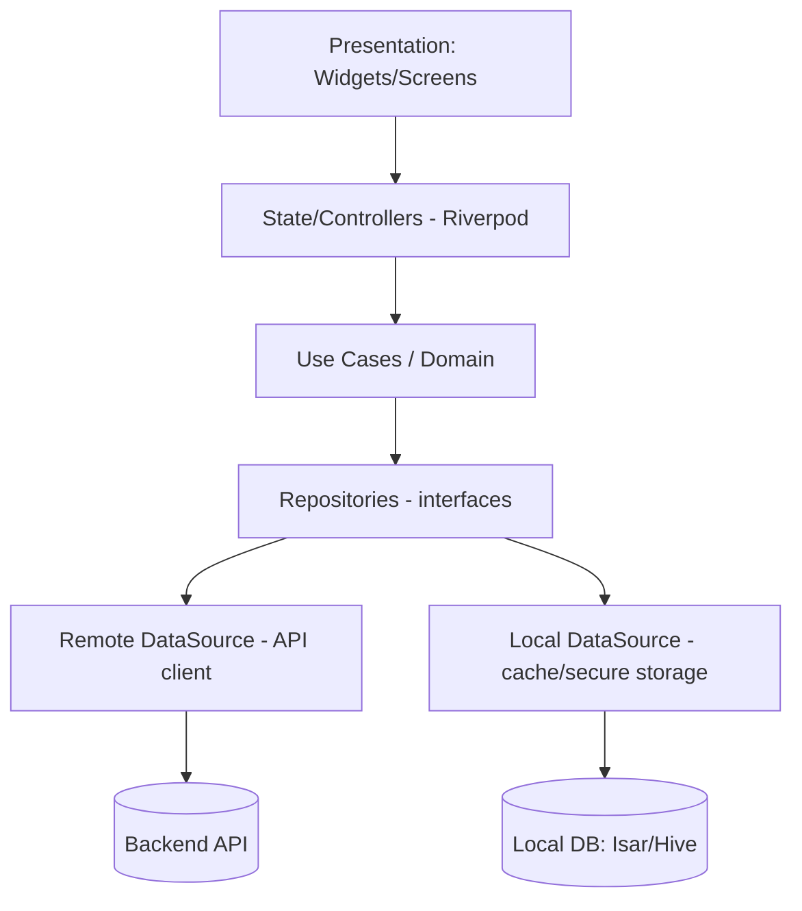

# Mobile Architecture

## 1. Framework decision
**Flutter** (Dart). Rationale in `engineering/tech-stack.md`. Single codebase iOS+Android, strong custom-UI/animation for the viewer, good performance on mid-range Android (a core India requirement).

## 2. Architecture pattern
**Clean Architecture + feature-first modularization**, with **Riverpod** (or Bloc) for state.



## 3. Layering
| Layer | Contents | Rules |
|---|---|---|
| Presentation | Screens, widgets, controllers | No business logic; reacts to state |
| Domain | Entities, use-cases, repo interfaces | Pure Dart, testable, no Flutter deps |
| Data | Repo impls, DTOs, datasources | Maps DTO↔entity; caching |
| Core | DI, theming, routing, error, network | Shared infra |

## 4. Feature modules (map to screens)
`onboarding · auth · stores · discovery · product · outfit_builder · body_capture · avatar · tryon_viewer · fit_report · texture · cart · handoff · saved · profile · privacy · settings`

## 5. Key technical components
| Concern | Choice |
|---|---|
| Networking | `dio` + interceptors (auth, retry, logging) |
| State | `riverpod` |
| Routing | `go_router` (deep-link ready for handoff) |
| Local storage | `isar`/`hive` (cache), `flutter_secure_storage` (tokens) |
| Images | `cached_network_image` + progressive loading |
| 360° viewer | Image-sequence viewer (MVP) → `flutter_gl`/`filament` (V3 3D) |
| Camera/upload | `image_picker`/`camera` + client-side quality pre-check |
| Push | FCM (job-complete notifications) |
| Analytics | Wrapper over provider (privacy-safe events) |
| Accessibility | Semantics widgets, dynamic text scale, high-contrast theme |

## 6. The 360° viewer architecture (honest, upgrade-ready)
```mermaid
flowchart LR
    subgraph ViewerAbstraction
      IV[OutfitViewer interface]
    end
    IV --> MVP[MultiAngleImageViewer\n(≥8 yaw renders + zoom)]
    IV --> V3[Realtime3DViewer\n(avatar+garment mesh)]
    style V3 stroke-dasharray: 5 5
```
The app codes against `OutfitViewer`; MVP ships `MultiAngleImageViewer` (drag = swap angle, pinch = zoom). V3 swaps in `Realtime3DViewer` with no screen-logic changes. **No faked 3D.**

## 7. Offline & low-connectivity (India requirement)
- Cache catalog, avatars, renders, saved outfits locally.
- "Data-saver" mode: lower-res renders, deferred prefetch.
- Graceful job-status resume after reconnect.

## 8. Performance targets (mid-range Android)
| Metric | Target `UNVERIFIED until measured` |
|---|---|
| Cold start | < 2.5s |
| Viewer frame rate | 60fps drag on multi-angle |
| Memory | Fit within 2–3GB devices |
| Render download | Progressive; usable on 4G |

## 9. Testing (see `engineering/testing.md`)
Unit (domain/use-cases), widget tests (key screens), golden tests (viewer, fit report), integration tests (upload→job→result flow with mocked backend).

## 10. Build/release
Flavors: dev/staging/prod. CI builds APK/IPA; Play/App Store pipelines. Feature flags for gating V2/V3 features.
