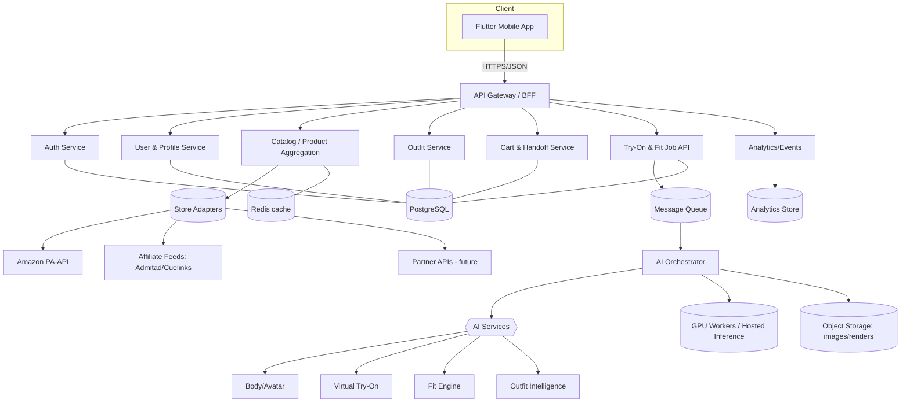
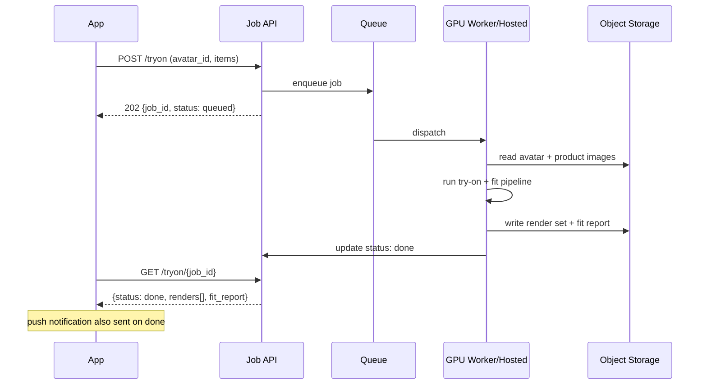

# System Architecture

## 1. Architectural principles
- **Modular & adapter-driven:** stores and AI models sit behind interfaces so any one can be swapped without touching the app.
- **Async-first for GPU work:** all heavy AI runs as background jobs; the app never blocks.
- **Buy-then-build:** start with hosted AI + managed infra; self-host when volume justifies it.
- **Privacy-by-design:** body data is isolated, encrypted, minimally retained, deletable.
- **Stateless services + horizontal scale:** API is stateless; state lives in Postgres/Redis/object storage.

## 2. High-level system diagram

## 3. Component responsibilities
| Component | Responsibility |
|---|---|
| **Mobile app (Flutter)** | UI, capture, viewer, offline-friendly state |
| **API Gateway / BFF** | AuthN/Z, routing, rate-limit, request shaping for mobile |
| **Auth service** | Registration, OTP/social login, JWT/refresh, sessions |
| **User & Profile** | Profiles, body-profile versions, consent records |
| **Catalog aggregation** | Normalized products from adapters; caching; search |
| **Store adapters** | Per-store `StoreIntegration` impls + capability sets |
| **Outfit service** | Outfits, saved looks, outfit scoring orchestration |
| **Cart & handoff** | Internal cart, deep-link builder, affiliate attribution |
| **Try-on/Fit job API** | Enqueue + status of async AI jobs |
| **AI orchestrator** | Pipeline sequencing across AI services + GPU/hosted |
| **AI services** | Body/avatar, try-on, fit, outfit (modular, mockable) |
| **Object storage** | Uploaded photos, avatars, renders (encrypted) |
| **Analytics** | Event capture → metrics (privacy-safe) |

## 4. Request patterns
- **Sync:** auth, catalog search, outfit CRUD, cart, handoff → fast REST.
- **Async:** avatar generation, try-on render, fit analysis → enqueue job → poll/push on completion.

## 5. Async job lifecycle

## 6. Environments
Dev (Docker Compose, mock AI) → Staging (managed, hosted AI, sample data) → Prod (autoscaled API, GPU workers or hosted inference, CDN). See `engineering/deployment.md`.

## 7. Cross-cutting concerns
- **Security:** TLS everywhere, encryption at rest, secrets manager, rate limiting, input validation (`compliance/security.md`).
- **Privacy:** body-data isolation + retention policy (`compliance/privacy.md`).
- **Observability:** structured logs, tracing, error tracking, cost-per-inference metric.
- **Resilience:** queue retries, idempotent jobs, graceful degradation when a store adapter is down.
