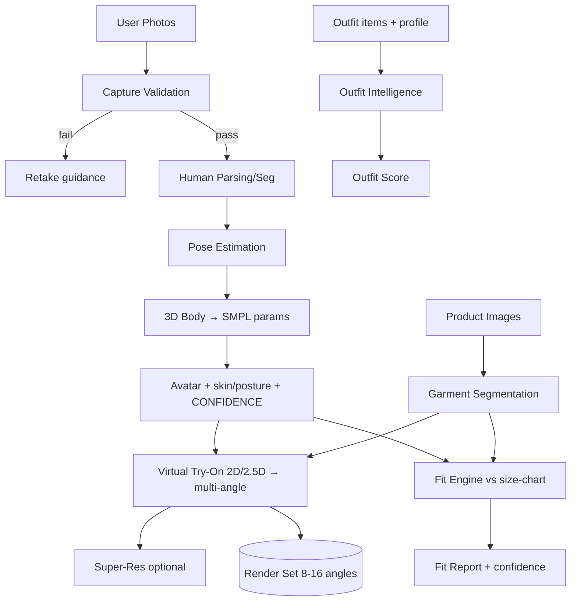
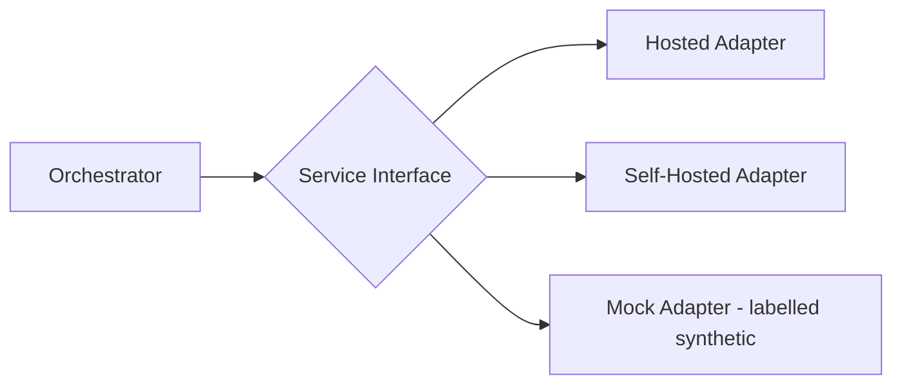
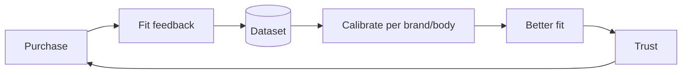

# Diagram — AI Pipeline

```mermaid
flowchart TD
    IMG[User Photos] --> VAL[Capture Validation]
    VAL -- fail --> RT[Retake guidance]
    VAL -- pass --> PARSE[Human Parsing/Seg]
    PARSE --> POSE[Pose Estimation]
    POSE --> BODY[3D Body → SMPL params]
    BODY --> AV[Avatar + skin/posture + CONFIDENCE]

    PROD[Product Images] --> GS[Garment Segmentation]
    AV --> VTO[Virtual Try-On 2D/2.5D → multi-angle]
    GS --> VTO
    VTO --> SR[Super-Res optional]
    VTO --> RS[(Render Set 8-16 angles)]

    AV --> FIT[Fit Engine vs size-chart]
    GS --> FIT
    FIT --> FR[Fit Report + confidence]

    ITEMS[Outfit items + profile] --> STYLE[Outfit Intelligence]
    STYLE --> OS[Outfit Score]
```

**Adapter pattern (per service)**

```mermaid
flowchart LR
    ORCH[Orchestrator] --> IF{Service Interface}
    IF --> H[Hosted Adapter]
    IF --> S[Self-Hosted Adapter]
    IF --> MK[Mock Adapter - labelled synthetic]
```

**Fit-data flywheel**

```mermaid
flowchart LR
    BUY[Purchase] --> FB[Fit feedback] --> DATA[(Dataset)]
    DATA --> CAL[Calibrate per brand/body] --> BETTER[Better fit] --> TRUST[Trust] --> BUY
```
Detail: `architecture/ai-architecture.md`, `ai/*`.
