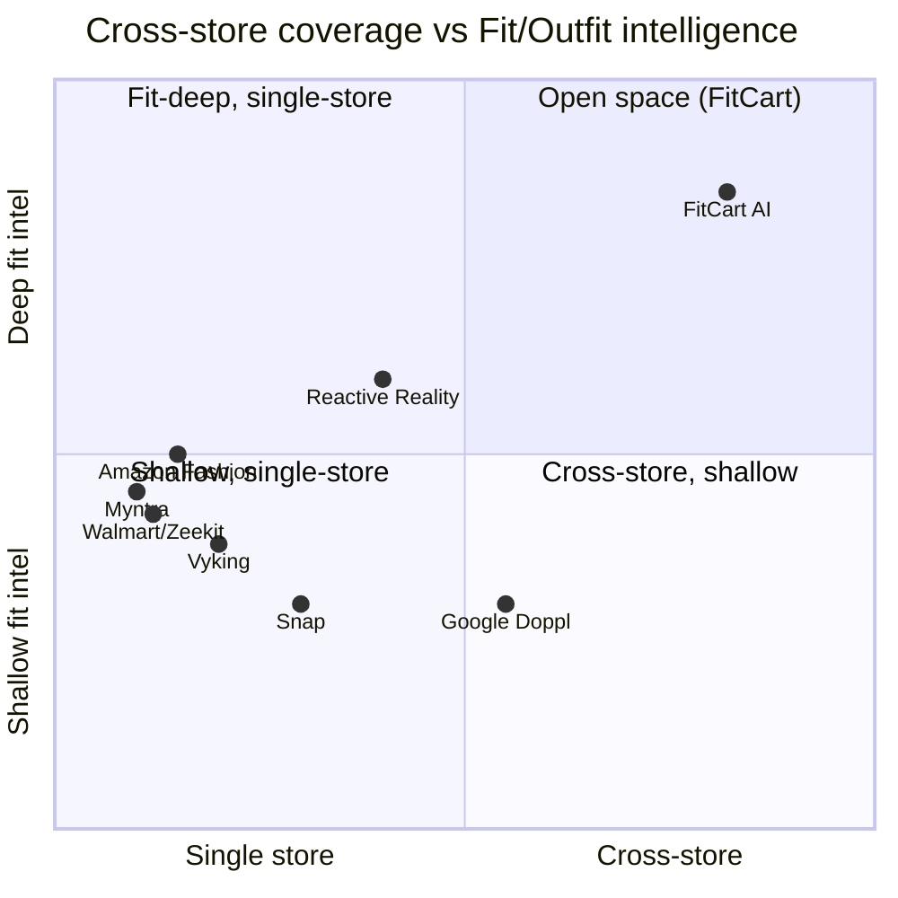
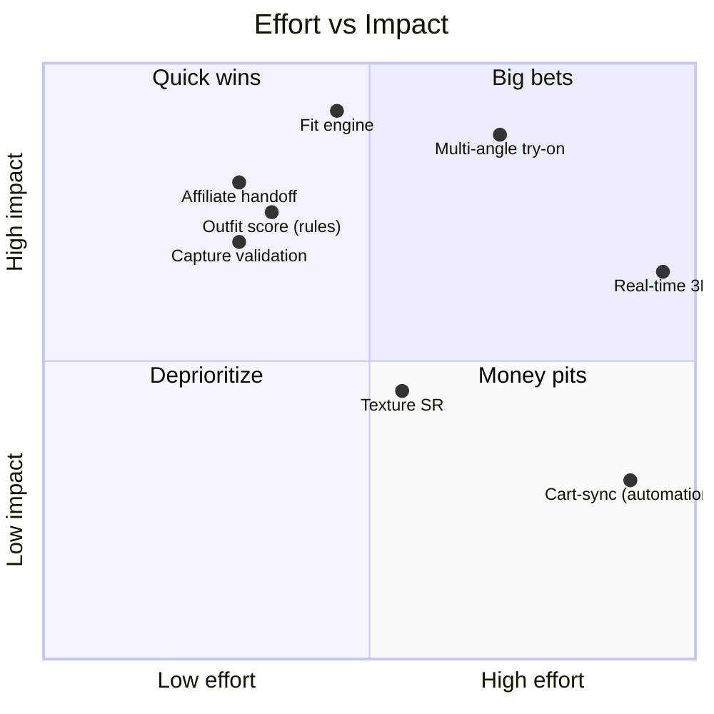

# Diagram — Competitive Positioning

**Positioning: cross-store coverage (x) × fit/outfit intelligence depth (y)**

**Effort vs Impact (feature prioritization)**

**Composite scores (thesis-weighted)**
| Player | Score |
|---|---|
| FitCart AI (target) | 8.0 |
| Google Doppl | 8.5 |
| Reactive Reality | 6.0 |
| Walmart/Zeekit | 6.0 |
| Snap | 6.0 |
| Vyking | 5.0 |
| Myntra (as rival) | 3.5 |

> FitCart owns the empty top-right quadrant; it does **not** claim to beat Google on raw realism. Detail: `research/competitors.md`, `docs/competitive-analysis.md`.
