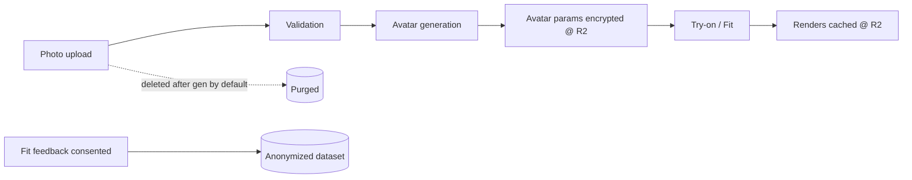
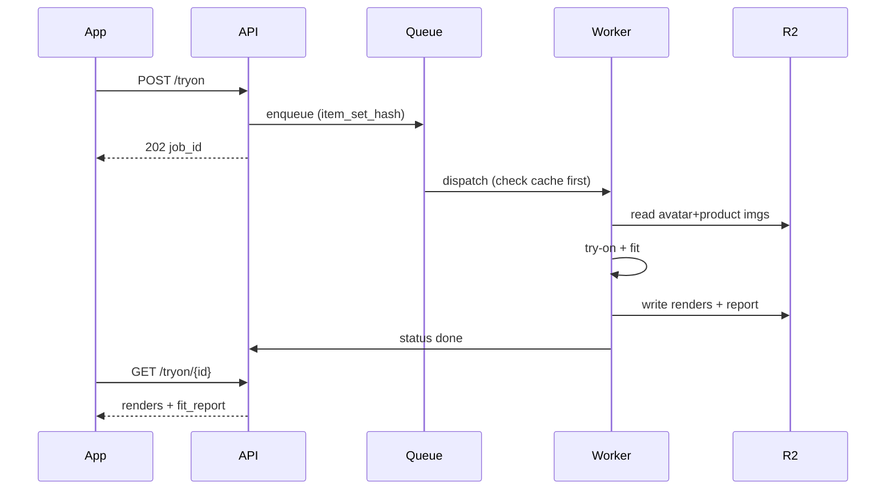
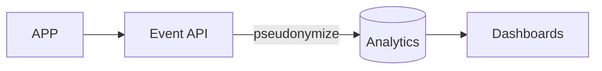

# Diagram — Data Flow

**Body-data lifecycle (privacy-first)**

**Request → async job → result**

**Analytics (privacy-safe)**

Detail: `architecture/data-architecture.md`, `compliance/privacy.md`.
