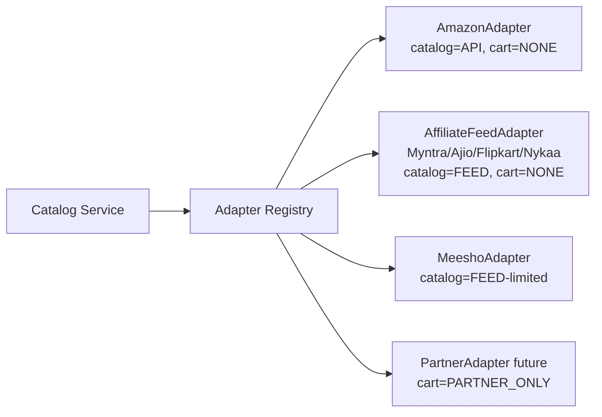
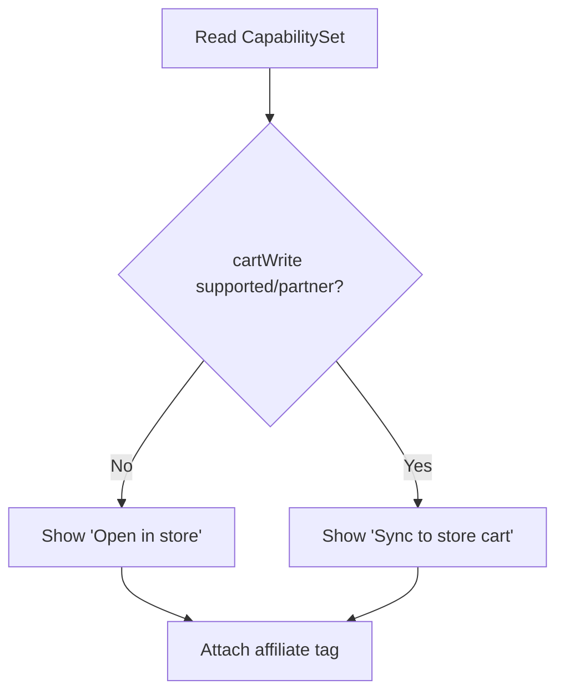
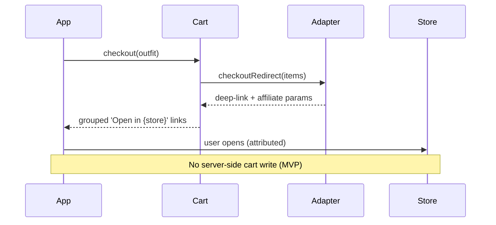

# Diagram — Integration Flow

**Adapter registry + capabilities**

**UI adapts to capability**

**Handoff sequence (compliant)**

Detail + capability truth-table: `architecture/integration-architecture.md`, `research/platform-api-research.md`.
