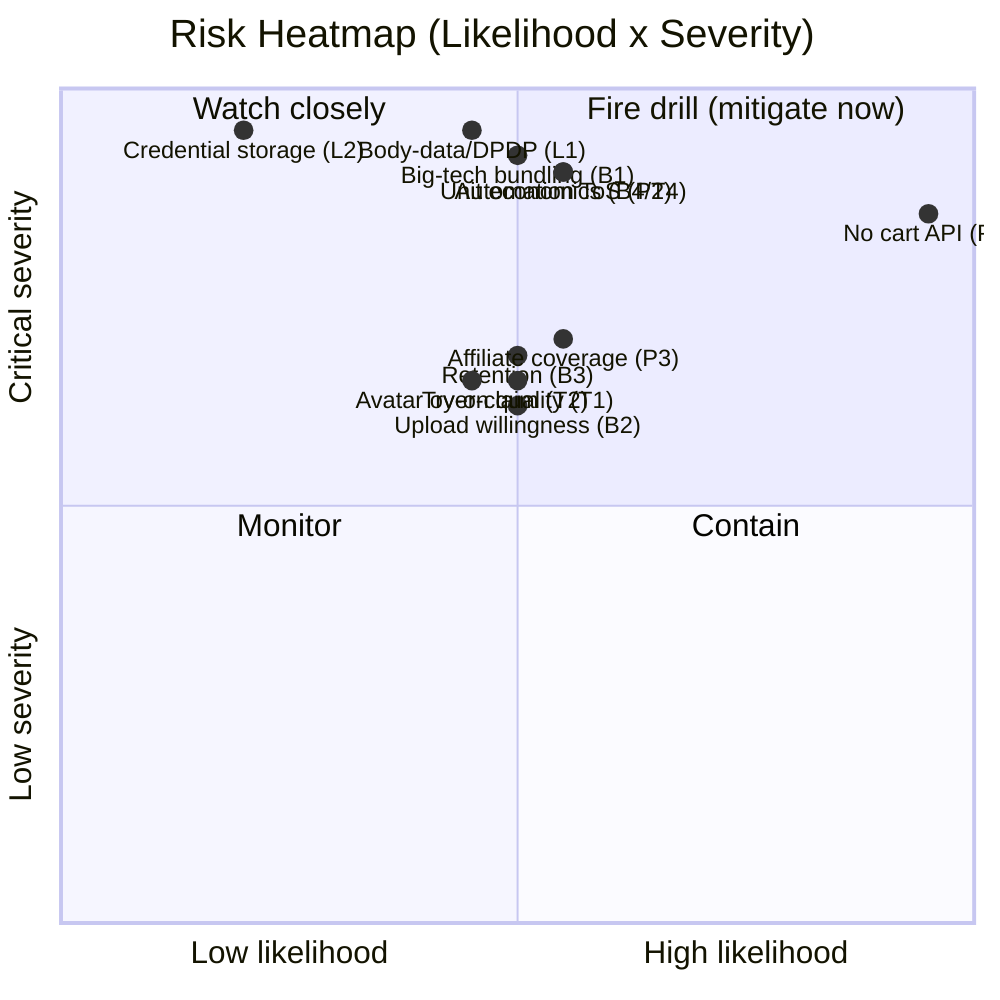

# Diagram — Risk Heatmap

**Severity × Likelihood (top risks plotted)**

**Priority legend**
| Band | Meaning | Examples |
|---|---|---|
| 🔴 Critical | Mitigate before scaling | P1, P2, L1, L2, B4/T4, B1 |
| 🟠 High | Active mitigation | P3, T1, T2, B2, B3, L4 |
| 🟡 Medium | Monitor | P5, T5, O2, B5 |

**Top-5 board risks**
1. 🔴 Cart-sync not officially possible → reframe MVP (P1/P2).
2. 🔴 Body-data + credentials under DPDP (L1/L2).
3. 🔴 Unit economics (B4/T4).
4. 🔴 Big-tech bundling (B1).
5. 🟠 AI quality & honesty (T1/T2).

Detail + mitigations: `docs/risks.md`.
