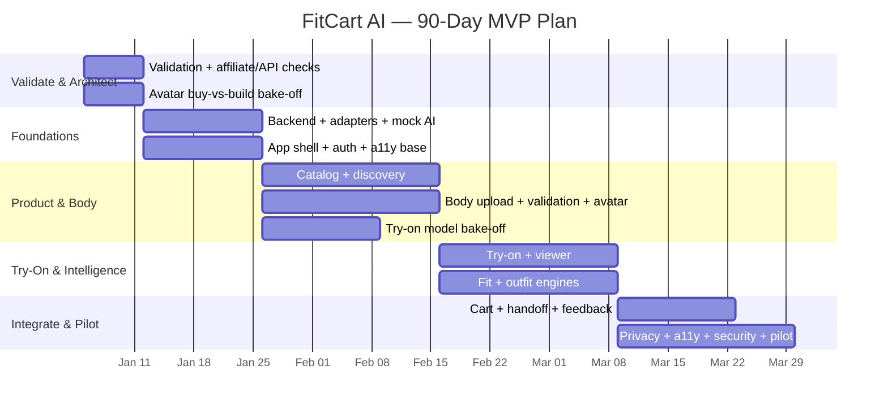
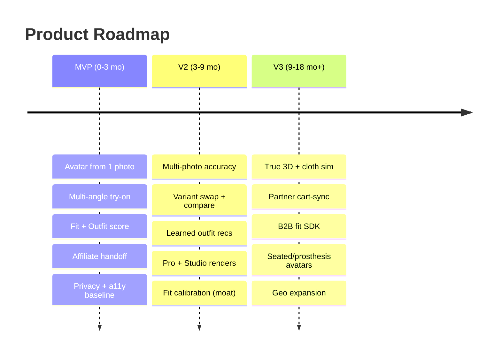

# Diagram — Roadmap Timeline

**90-day plan (Gantt)**

**Product horizon**

> Dates illustrative (relative to project start). Detail: `roadmap/90-day-plan.md`, `roadmap/mvp.md`, `roadmap/v2.md`, `roadmap/v3.md`.
