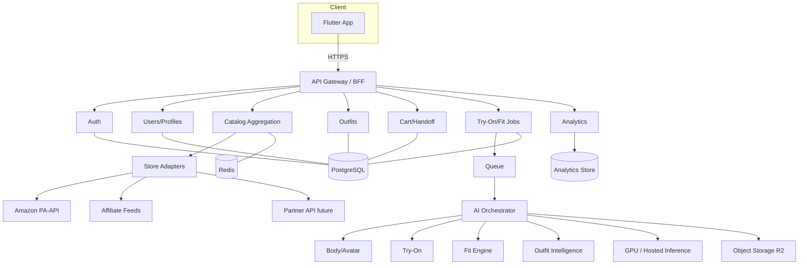
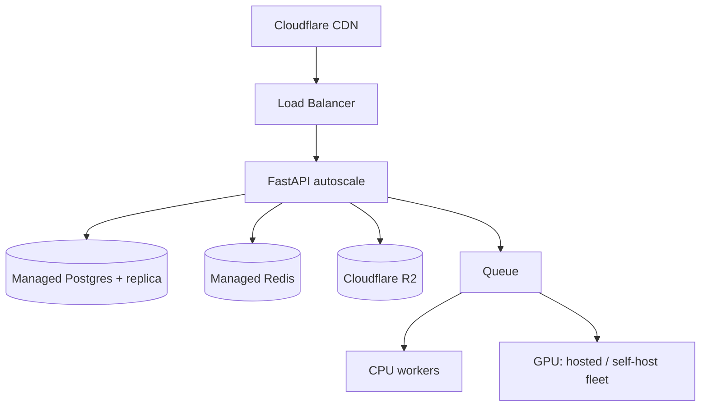

# Diagram — System Architecture

```mermaid
flowchart TD
    subgraph Client
      M[Flutter App]
    end
    M -->|HTTPS| GW[API Gateway / BFF]
    GW --> AUTH[Auth]
    GW --> USER[Users/Profiles]
    GW --> CAT[Catalog Aggregation]
    GW --> OUT[Outfits]
    GW --> CART[Cart/Handoff]
    GW --> JOBS[Try-On/Fit Jobs]

    CAT --> ADP[Store Adapters]
    ADP --> AMZ[Amazon PA-API]
    ADP --> AFF[Affiliate Feeds]
    ADP --> PART[Partner API future]

    JOBS --> Q[Queue]
    Q --> ORCH[AI Orchestrator]
    ORCH --> BODY[Body/Avatar]
    ORCH --> VTO[Try-On]
    ORCH --> FIT[Fit Engine]
    ORCH --> STYLE[Outfit Intelligence]
    ORCH --> GPU[GPU / Hosted Inference]
    ORCH --> OBJ[Object Storage R2]

    AUTH --- PG[(PostgreSQL)]
    USER --- PG
    OUT --- PG
    CART --- PG
    JOBS --- PG
    CAT --- REDIS[(Redis)]
    GW --> AN[Analytics] --> DW[(Analytics Store)]
```

**Deployment topology**

```mermaid
flowchart TD
    CDN[Cloudflare CDN] --> LB[Load Balancer] --> API[FastAPI autoscale]
    API --> PG[(Managed Postgres + replica)]
    API --> RD[(Managed Redis)]
    API --> R2[(Cloudflare R2)]
    API --> Q[Queue] --> CPU[CPU workers]
    Q --> GPUW[GPU: hosted / self-host fleet]
```
Detail: `architecture/system-architecture.md`, `engineering/deployment.md`.
