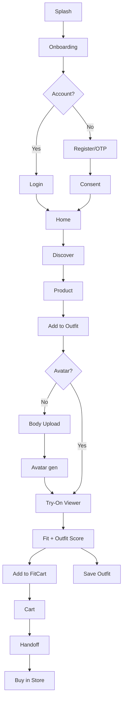
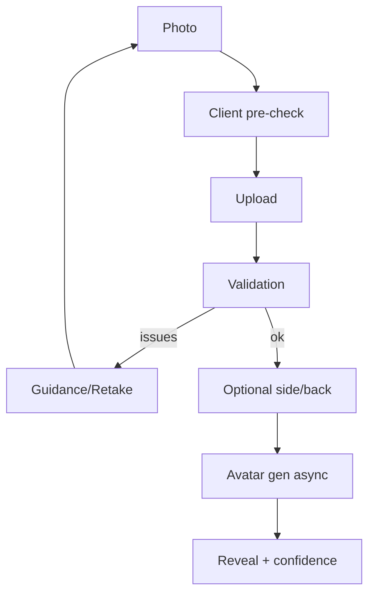
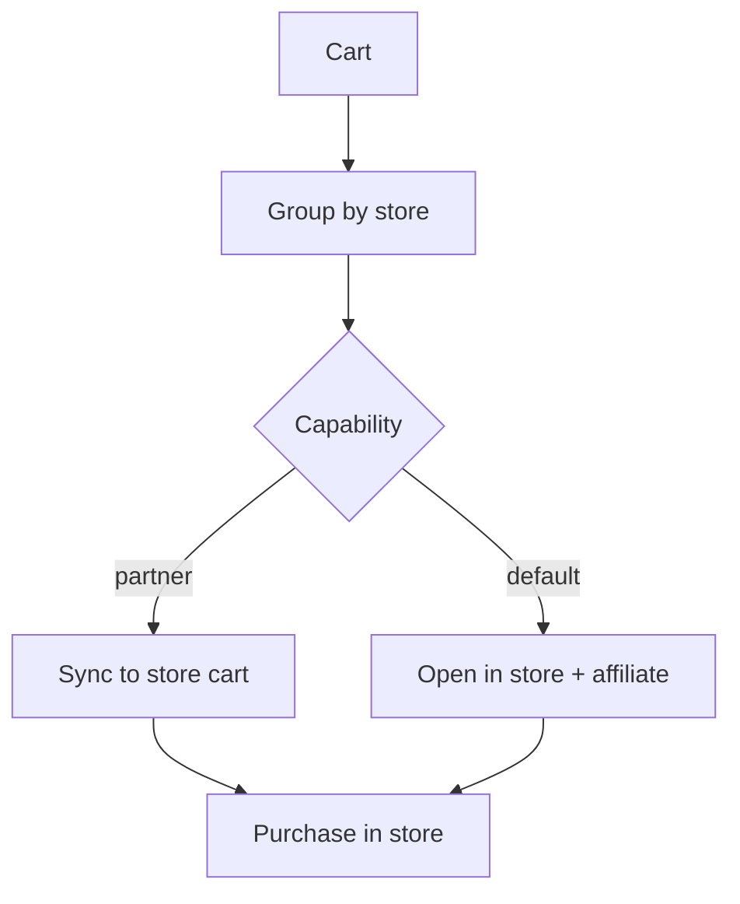

# Diagram — User Flow

**Master flow**

```mermaid
flowchart TD
    A[Splash] --> B[Onboarding] --> C{Account?}
    C -- No --> D[Register/OTP] --> F[Consent]
    C -- Yes --> E[Login] --> G[Home]
    F --> G
    G --> I[Discover] --> J[Product] --> K[Add to Outfit]
    K --> L{Avatar?}
    L -- No --> M[Body Upload] --> N[Avatar gen] --> O[Try-On]
    L -- Yes --> O[Try-On Viewer]
    O --> P[Fit + Outfit Score]
    P --> Q[Add to FitCart] --> R[Cart] --> S[Handoff] --> T[Buy in Store]
    P --> U[Save Outfit]
```

**Body upload quality gate**

```mermaid
flowchart TD
    A[Photo] --> B[Client pre-check] --> C[Upload] --> D[Validation]
    D -- issues --> E[Guidance/Retake] --> A
    D -- ok --> F[Optional side/back] --> G[Avatar gen async] --> H[Reveal + confidence]
```

**Checkout handoff (honest)**

```mermaid
flowchart TD
    A[Cart] --> B[Group by store] --> C{Capability}
    C -- partner --> D[Sync to store cart]
    C -- default --> E[Open in store + affiliate]
    D --> F[Purchase in store]
    E --> F
```
Detail: `ux/user-flow.md`.
