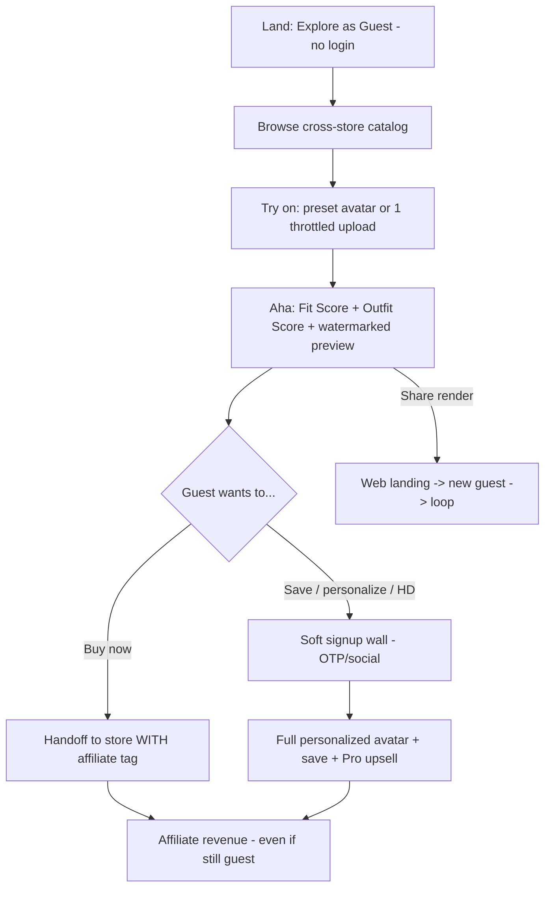

# Guest "Explore" Free-Trial Strategy (Fast User Capture — Without Breaking Revenue)

> **Founder directive:** *"For fast user capture, the free model lives in Explore as a guest — no login needed on trial — but make sure that doesn't break our revenue."*
>
> This document turns that into a concrete, guard-railed design. **The guest experience is a demo funnel, not the full product.** It maximizes top-of-funnel capture while protecting the two things that could break: **affiliate revenue** and **inference cost / unit economics**.

## 1. Principle
> **Show the aha for free and instantly; gate the *keep* and the *expensive*.**
Guests get enough magic to be hooked (a try-on + a fit score) without an account. They convert to signup at the moment they want to **save, personalize, or scale** usage — the value-capture line.

## 2. What a guest CAN do (no login)
| Guest capability | Why it's safe |
|---|---|
| Browse cross-store catalog | Read-only; affiliate links carry tags → revenue safe |
| Try on using a **preset/demo avatar** (pick body type close to them) | Preset avatars are **shared** → renders cache with very high hit-rate → cheap |
| **One quick guest upload** → a *lightweight* avatar (throttled, lower-fidelity) | Bounded by strict per-device caps + bot protection |
| See a **Fit Score + Outfit Score** (the aha) | Cheap compute; the hook |
| Get a **standard-res, watermarked** multi-angle preview | Lower cost than HD; watermark drives signup/share |
| **Checkout handoff with affiliate tag** | **Revenue preserved even for anonymous users** |
| Share a render (viral loop) | Growth; shared link → web landing → signup prompt |

## 3. What requires signup (the conversion wall)
| Gated behind account | Why |
|---|---|
| **Personalized full-quality avatar** (the expensive GPU step) | Protects unit economics — the #1 cost risk |
| **Save** outfits / avatar / history | Value-capture moment → natural signup trigger |
| **HD / un-watermarked / Studio renders** | Pro/premium value |
| Unlimited try-ons (beyond guest cap) | Bounds free cost |
| Multiple avatars, fit history, recommendations | Retention features |
| Post-purchase fit-feedback loop | Tied to identity (moat data) |

**Soft wall, not hard wall:** the guest sees the result first, *then* is prompted ("Sign up to save this look / make it truly you"). Never block the aha.

## 4. How this does NOT break revenue — three protections

### Protection A — Affiliate attribution survives anonymity ✅
Affiliate commission is earned on the **outbound link/click**, carried by URL/affiliate params — **not** by having a FitCart account. So a guest who tries on and taps "Open in Myntra" **still generates commission**. Guest mode therefore *expands* the affiliate top-of-funnel rather than leaking it. *(Attribution flow: `architecture/integration-architecture.md`.)*

### Protection B — Cost is bounded, personalized avatar is gated ✅
The expensive operation is **personalized avatar generation** (+ HD multi-angle renders). Guests get:
- **Preset/demo avatars** whose renders are **aggressively cached and reused** across all guests (huge cache-hit; near-zero marginal cost per additional guest).
- If a guest uploads, a **throttled, lower-fidelity** avatar with **hard per-device/per-IP caps** and **bot/WAF protection** (cost-bombing defense already in `compliance/security.md`).
- **Fewer angles + standard resolution** for guests; HD gated to signed-in/Pro.
- Full personalized avatar → **requires at least a lightweight account** (email/OTP), which also unlocks retention + Pro.

### Protection C — Guest doesn't cannibalize Pro ✅
Guest = a *taste* (watermarked, preset avatar, capped, no save). Pro = *personalization + persistence + HD + unlimited*. The free guest tier is deliberately **shallow enough to convert**, not a free substitute for Pro. (Free tier boundary already defined in `docs/monetization.md`.)

## 5. Abuse & cost-control guardrails (mandatory)
| Guardrail | Purpose |
|---|---|
| Per-device fingerprint + per-IP **rate limits** on guest try-ons | Bound cost; stop farming |
| **WAF + bot protection** on guest render/upload endpoints | Cost-bombing defense |
| **Preset-avatar render cache** (shared across guests) | Slash marginal cost |
| Guest try-on cap (e.g., 3–5) → soft signup wall | Bound cost; drive conversion |
| **Watermark** on guest renders | Drives share + signup |
| Personalized avatar gen **disabled for pure-anonymous** (needs lightweight account) | Protect unit economics |
| Guest sessions **expire**; no long-term storage of guest body photos | Cost + privacy (DPDP) |
| Cost-per-guest tracked as a live metric | Kill-switch if it drifts |

## 6. Guest → account → revenue funnel

## 7. Privacy for guests (DPDP)
- Guest uploads (if any) are **ephemeral**: processed for the throttled avatar, then **deleted on session expiry** — no persistent guest body-data store.
- Consent for processing is still shown before any guest upload (lightweight, honest).
- Detail: `compliance/privacy.md`.

## 8. Metrics for guest mode
| Metric | Why |
|---|---|
| Guest → aha (first try-on) rate | Funnel top health |
| **Guest → signup conversion** | Capture working without cannibalizing |
| **Guest → affiliate handoff rate** | Anonymous revenue proof |
| **Cost per guest session** | Unit-economics guardrail (must stay tiny) |
| Guest share → new-guest rate | Virality |

## 9. Success test (the guardrail restated)
Guest mode is a **win** only if: (1) it lifts top-of-funnel + signups, (2) **affiliate revenue per visitor rises** (anonymous handoffs count), and (3) **cost per guest session stays negligible** (preset-avatar caching + caps + bot protection). If cost-per-guest ever approaches guest-generated affiliate value, tighten caps / push more to preset avatars *before* scaling. This is the concrete meaning of *"don't break our revenue."*
