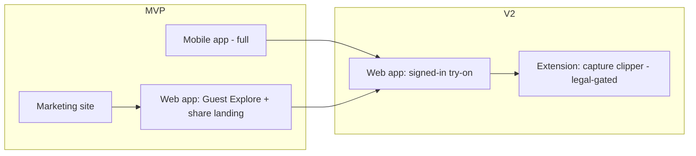

# Product Surfaces Strategy

> FitCart AI is not "just an app." It is a product delivered across **four surfaces**, each with a distinct job. This document decides **what ships where, in what order, and why** — and is deliberately honest about where a browser extension is useful vs. where it becomes a legal/ToS liability (see `compliance/platform-integration-risks.md`).

## 1. The four surfaces
| Surface | Primary job | Priority |
|---|---|---|
| **Mobile app (Flutter)** | The full product — photo capture, personalized avatar, try-on, fit/outfit, handoff | **P0 — core** |
| **Marketing website** | Acquisition, SEO, story, trust, conversion → app installs + web explore | **P0 — launch with MVP** |
| **Web app (responsive)** | Guest "Explore" demo + desktop users + shareable renders (virality) | **P1 — MVP/early V2** |
| **Browser extension** | "Add to FitCart while browsing a store" **capture clipper** (NOT a cart-writer) | **P2 — V2/V3, legal-gated** |

Details: marketing site `web/marketing-website.md` · web app `web/web-app.md` · extension `web/browser-extension.md` · guest funnel `docs/guest-trial-strategy.md`.

## 2. Why each surface exists

### Mobile app — the core
Best surface for **camera capture + the "aha"** (avatar reveal + fit score). Full feature set, best performance on mid-range Android (India). Everything in the existing blueprint (`architecture/mobile-architecture.md`) stands.

### Marketing website — the front door
- **Job:** explain the product, build trust (privacy-first), rank in search, and convert visitors into **app installs** or **web-explore trials**.
- Ships **at MVP launch** — a product this visual dies without a place to show the demo.

### Web app — reach + virality + guest explore
- **Job:** let people **try the guest "Explore" demo in a browser with no install**, serve desktop shoppers, and — critically — be the **landing surface for shared renders** ("see this outfit on an avatar" links open on web → viral loop → install prompt).
- **Recommendation:** build the web app around the **guest Explore experience** first (lower-fidelity, demo-avatar try-on) and use it as the top-of-funnel. Full personalized flows still push to the app or a signed-in web session.

### Browser extension — useful, but narrowly and later
- **Legitimate job:** a user browsing Myntra/Amazon clicks **"Add to FitCart"** to clip a product into their outfit builder (a wishlist/clipper). User-initiated, reads minimal public product data from the page the user is already viewing.
- **Explicitly NOT its job:** injecting items into the store's cart or automating the store session. That path was ruled out (ToS + DPDP + fragility) in `compliance/platform-integration-risks.md` and remains ruled out.
- **Risk to manage:** even a clipper touches store pages → possible ToS/scraping concerns → **requires legal review before build**. Desktop-only, so it's a secondary convenience, not the core (mobile-first product).
- **Verdict:** `V2/V3, LEGAL-GATED, capture-only`. "Whichever suits" → **web app + marketing site clearly suit first; the extension is an optional later capture aid, never a cart-sync backdoor.**

## 3. Recommended surface roadmap

## 4. Shared foundation (one backend, many surfaces)
All surfaces call the **same FastAPI backend + AI services** (`architecture/backend-architecture.md`). This is why the surface expansion is cheap:
- Mobile (Flutter) and Web app (recommend **Flutter Web** or a lightweight React web client) share APIs.
- **Recommendation:** evaluate **Flutter Web** to reuse the mobile codebase for the web app; if SEO/marketing pages need it, build the **marketing site separately** (Next.js/Astro) for best SEO — marketing pages and the interactive web app have different needs.
- Extension is a thin client that posts captured products to the same `/catalog`/`/outfits` APIs.

## 5. Surface → capability matrix
| Capability | Mobile | Web app | Marketing site | Extension |
|---|---|---|---|---|
| Guest Explore (demo avatar try-on) | ✅ | ✅ (primary) | ↗ links to it | — |
| Photo upload → personalized avatar | ✅ | ✅ (signed-in) | — | — |
| Full outfit builder + fit/outfit score | ✅ | ✅ | — | ↗ (clip → builder) |
| Product capture while browsing store | — | — | — | ✅ (V2, legal-gated) |
| Shareable render landing | ✅ open | ✅ (host) | ✅ | — |
| SEO / content / trust | — | partial | ✅ (primary) | — |
| Checkout handoff (affiliate) | ✅ | ✅ | ↗ | ✅ |

## 6. Revenue & cost note (critical)
Every surface **must preserve affiliate attribution** on handoff (the tag is on the link/click, not the account) — so even anonymous web/extension users generate commission. Every surface **must respect the cost guardrails** for guest usage (caps, demo-avatar caching, bot protection). Both are specified in `docs/guest-trial-strategy.md`. **No surface may offer the expensive personalized-avatar generation to an un-throttled anonymous user** — that is the one thing that would break unit economics.
