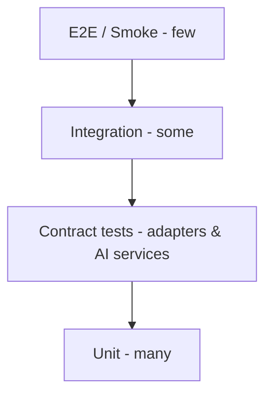

# Engineering — Testing Strategy

> Principle from the brief: **run the tests, don't just write them.** Contract tests are especially important because store adapters and AI services are swappable — the contract is the guarantee.

## 1. Test pyramid

## 2. Backend
| Level | Scope | Tools |
|---|---|---|
| Unit | Services (fit engine, outfit engine, normalization, deep-link builder) | pytest |
| Contract | `StoreIntegration` + `AIService` implementations satisfy their schema | pytest + schema fixtures |
| Integration | API routes with test DB + mock AI + fake adapters | pytest + httpx + testcontainers |
| E2E/Smoke | upload→job→render→fit happy path on staging | pytest/newman |

**Fit engine** gets a rich fixture suite (known body + size chart → expected region fits) since it's deterministic and moat-critical.

## 3. Store adapter contract tests
Every adapter must pass a shared suite proving it honors `CapabilitySet` truthfully:
- If `cartWrite=UNSUPPORTED`, `addToCart` must return `Unsupported` (never silently fake success).
- `checkoutRedirect` returns a valid affiliate-tagged deep-link.
- `getProducts` returns normalized `Product` (or explicit nulls).
This prevents the app from ever promising cart-sync a store can't do.

## 4. AI service contract tests
- Mock/hosted/self-host adapters all satisfy the same input/output schema.
- Mock outputs are **flagged synthetic**.
- Confidence field is always present on avatar/fit outputs (guardrail test).

## 5. Mobile (Flutter)
| Level | Scope |
|---|---|
| Unit | Use-cases, mappers, controllers |
| Widget | Key screens (upload, viewer, fit report) |
| Golden | Viewer states, fit report layout |
| Integration | Upload→job→result with mocked backend |
| Accessibility | Semantics present; screen-reader labels; contrast |

## 6. Non-functional testing
- **Load:** API + queue under concurrent try-on jobs.
- **Cost:** measure inference cost/job in staging (guards unit economics).
- **Security:** dependency scan, SAST, secret scan in CI; periodic pen-test before launch.
- **Privacy:** automated check that delete-account purges body data + R2 objects within SLA.

## 7. CI gates
PR must pass: lint + typecheck + unit + contract + integration + security scan. Staging smoke before prod. Coverage tracked (quality over % target).

## 8. Test data & privacy
Use **synthetic/consented** body images for tests — never real user data in CI. Fixture catalog for deterministic product tests.

## 9. Definition of done (per feature)
Code + tests (unit+contract where applicable) **executed & passing** + docs updated + observability hooks + accessibility check. No feature is "done" on unrun tests.
