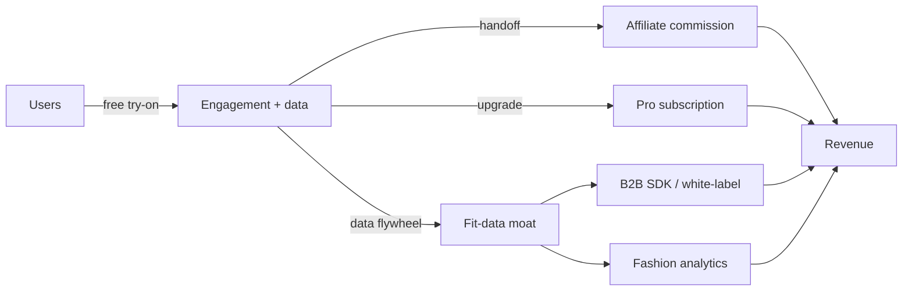

# Investor — Business Model

Companion to `docs/monetization.md` (product view) and `business/cost-model.md` (costs). This is the **investment-economics** view.

## 1. Model in one line
**Affiliate-led freemium** consumer app → **Pro subscription** + **B2B fit/try-on SDK**, defended by a **fit-data moat**.

## 2. Revenue architecture

## 3. Stream economics
| Stream | Margin | Timing | Scalability | Durability |
|---|---|---|---|---|
| Affiliate | High (rev-share, low COGS) | Day 1 | High | Medium (rate risk) |
| Pro subscription | High | MVP/V2 | High | Medium-High |
| Studio renders | Medium (inference cost) | V2 | Medium | Medium |
| Brand partnerships | High | V2 | Medium | Medium |
| **B2B SDK** | **Very High** | V3 | **High** | **High (moat)** |
| Analytics | High | V3 | Medium | Medium |

## 4. Unit economics (illustrative — validate in pilot)
Per active user/month (`ASSUMPTION`):
- Revenue: affiliate ₹108 + Pro-blended ₹10 = **₹118**
- Infra/inference cost: target **< ₹30–₹50** at scale (see cost model)
- **Contribution/active user ≈ ₹68–₹88** before CAC & opex
- **The pilot must prove:** revenue/active user **>** inference cost/active user. If not, cost controls (caching, free caps, self-host) or pricing must close it before scaling.

## 5. Growth model
- **Acquisition:** affiliate-led + organic + niche communities (plus-size, fashion, students). Low paid CAC early.
- **Activation:** first try-on aha (target ≥35%).
- **Retention:** fit accuracy + saved outfits + recommendations → habit.
- **Referral:** shareable renders/lookbooks (V2).
- **Revenue:** affiliate now, Pro as engagement proves, SDK as moat matures.

## 6. Why the model is investable
1. **Day-one revenue** (affiliate) — not purely pre-revenue.
2. **Compounding moat** (fit data) → improving margins + defensibility.
3. **Optionality:** consumer *and* B2B (de-risks big-tech consumer competition).
4. **Capital-efficient MVP:** buy hosted AI, avoid GPU capex early.

## 7. Key assumptions to defend
- Affiliate rates + conversion (validate).
- Inference cost/user trajectory (control + measure).
- Pro willingness-to-pay in India (survey/pilot).
- Retention beyond novelty (pilot).

## 8. Sensitivity
| Lever | Downside case | Mitigation |
|---|---|---|
| Affiliate rate −50% | Margin squeeze | Push Pro + SDK earlier |
| Inference cost 2× | Unit economics break | Caching, free caps, self-host, fewer angles |
| Low Pro conversion | Slower rev | Lean on affiliate + B2B |
| Big-tech consumer entry | CAC/retention hit | Pivot emphasis to B2B SDK + partnerships |
