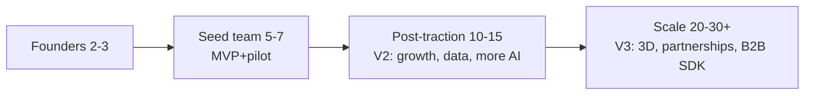

# Investor — Team & Hiring Plan

## 1. Founding team (ideal shape)
| Role | Owns | Why critical |
|---|---|---|
| **CEO / Product founder** | Vision, fundraising, partnerships, GTM | Partnerships unlock cart-sync (V3); story sells the round |
| **CTO / Principal engineer** | Architecture, backend, hiring | Ties AI + product + infra together |
| **AI/ML lead** (co-founder or first hire) | Body/try-on/fit models, AI orchestration | The technical differentiator |

A 2–3 person technical-heavy founding team is ideal; product + AI depth is non-negotiable.

## 2. First hires (post-pre-seed, ~5–7 total)
| Priority | Hire | Focus |
|---|---|---|
| 1 | **Senior Flutter engineer** | Mobile app + viewer |
| 2 | **Backend engineer (Python/FastAPI)** | APIs, adapters, jobs |
| 3 | **ML engineer** | Fit engine, model integration, cost tuning |
| 4 | **Product designer (UX)** | Flows, design system, accessibility |
| 5 (fractional) | **Legal/compliance counsel** | DPDP, affiliate terms, DPAs |

Fractional/advisor: **fashion-domain advisor** (styling/sizing), **security advisor**.

## 3. Scaling roadmap

| Stage | Team | Focus |
|---|---|---|
| Pre-seed | 2–3 founders | Validate + architect |
| Seed | 5–7 | MVP + pilot + first revenue |
| Series A prep | 10–15 | V2 growth, data moat, partnerships |
| Scale | 20–30+ | V3 3D, B2B SDK, geo expansion |

## 4. Org principles
- **Buy over build** early (hosted AI, avatar SDK) → keep team small, senior, focused.
- **Full-stack ownership** per feature; avoid premature specialization.
- **Compliance + security seniority early** (body data = existential risk).
- **Inclusion in the room** — diverse hiring supports the plus-size/accessibility product thesis.

## 5. Key-person risks & mitigation
| Risk | Mitigation |
|---|---|
| AI/ML single point of failure | Adapter architecture + hosted fallback + documentation |
| Founder partnership dependency (cart-sync) | Compliant MVP doesn't need it; parallel outreach |
| Hiring ML talent in a tight market | Buy hosted AI; hire pragmatic ML-integration engineers, not researchers |

## 6. Advisors to recruit
Fashion e-commerce operator (India) · privacy/DPDP counsel · AI/CV researcher (part-time) · a retail-partnership door-opener.
