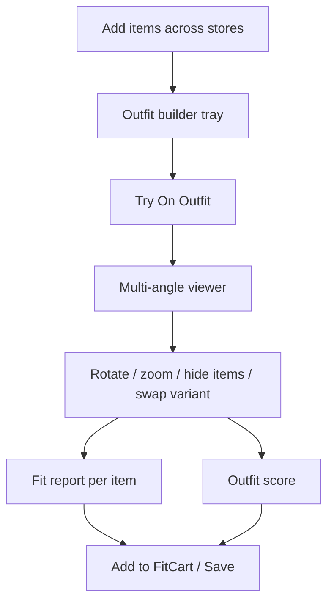
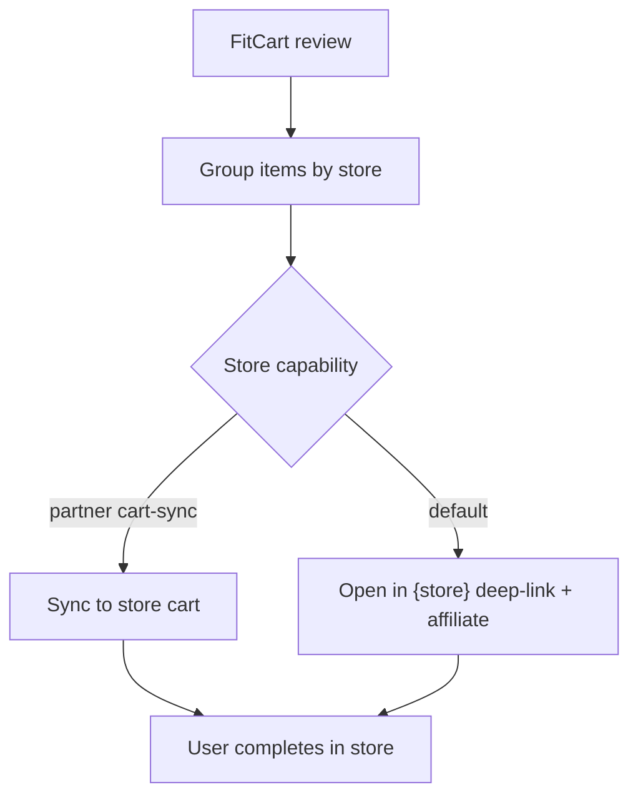

# UX — User Flows

Companion diagrams in `diagrams/user-flow.md`. Screen detail in `ux/screen-specifications.md`; wireframes in `ux/wireframes.md`.

## 1. Master flow (install → purchase)
```mermaid
flowchart TD
    A[Splash] --> B[Onboarding carousel]
    B --> C{Account?}
    C -- No --> D[Register / OTP]
    C -- Yes --> E[Login]
    D --> F[Consent (granular)]
    E --> G[Home]
    F --> G
    G --> H[Connect stores (optional)]
    G --> I[Discover / Search]
    I --> J[Product details]
    J --> K[Add to Outfit]
    K --> L{Avatar exists?}
    L -- No --> M[Body upload + validation]
    M --> N[Avatar generation (async)]
    N --> O[Try-On viewer]
    L -- Yes --> O
    O --> P[Fit report + Outfit score]
    P --> Q[Add to FitCart]
    Q --> R[Cart review]
    R --> S[Checkout handoff (deep-link/affiliate)]
    S --> T[Open store → purchase]
    P --> U[Save outfit]
```

## 2. Body-upload sub-flow (quality-gated)
```mermaid
flowchart TD
    A[Choose/take photo] --> B[Client pre-check]
    B --> C[Upload]
    C --> D[Server validation]
    D -- issues --> E[Guidance + retake]
    E --> A
    D -- ok --> F[Optional: add side/back]
    F --> G[Generate avatar (async)]
    G --> H[Progress + push on done]
    H --> I[Avatar reveal + confidence]
```

## 3. Outfit-build & try-on sub-flow


## 4. Checkout-handoff sub-flow (honest)


## 5. Consent & privacy flow
```mermaid
flowchart TD
    A[Before first upload] --> B[Explain what/why (plain language)]
    B --> C[Granular toggles: processing/storage/model-improvement/transfer]
    C --> D{Processing consent given?}
    D -- No --> E[Cannot generate avatar; explain]
    D -- Yes --> F[Proceed; consent recorded+versioned]
    F --> G[Anytime: view/revoke in Settings → Privacy]
```

## 6. Error / edge flows
| Situation | Flow |
|---|---|
| Bad photo | Validation → guidance → retake loop |
| Avatar gen fails | Retry + support; never blank-fail |
| Store feed down | Cached results + notice |
| Low connectivity | Data-saver; resume job later |
| Fit low confidence | Show honest "limited data" note |

## 7. Accessibility flow requirements
- Every visual state (viewer angles, fit score) has a **screen-reader description** and **textual fit narration**.
- Keyboard/switch navigation across all flows; large touch targets; no color-only signals.
