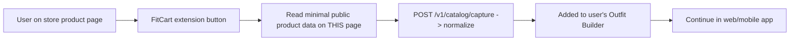

# Browser Extension Specification (Capture Clipper — NOT a Cart-Writer)

> **Read this first:** the extension is an **optional, later, legal-gated convenience** — a "clip a product into FitCart while browsing a store." It is **explicitly NOT** a tool that injects items into a store's cart or automates the store session. That path (server-side or extension-driven cart automation) was ruled out for ToS/DPDP/fragility reasons in `compliance/platform-integration-risks.md` and stays ruled out. This spec exists to define the *safe, narrow* version and to prevent scope-creep into the dangerous one.

## 1. The one legitimate job
A user browsing Myntra/Ajio/Amazon/etc. sees a product and clicks the FitCart extension button **"Add to FitCart"** → the product is clipped into their FitCart outfit builder (like a wishlist clipper). User-initiated, on a page the user is already viewing.

## 2. What it is / is not
| ✅ Is | ❌ Is not |
|---|---|
| User-initiated product **capture** (clip to outfit builder) | Cart injection / automated add-to-cart |
| Reads **minimal public product data** from the current page (title, image, price, URL) | Scraping catalogs in bulk / background crawling |
| Posts to our own `/catalog`/`/outfits` API | Logging into or automating the store session |
| Desktop convenience feeding the mobile/web app | A replacement for the core mobile product |

## 3. Priority & gating
- **Priority:** `P2 — V2/V3`.
- **LEGAL-GATED:** requires **explicit legal review** of each target store's ToS before shipping, because even a user-initiated clipper reads store-page data. If a store's ToS prohibits it, that store is excluded from the extension.
- **Desktop-only** → secondary to the mobile-first product; never on the critical path.

## 4. Why not sooner / not core
- The product is **mobile-first** (camera capture lives on the phone).
- Extensions add **maintenance fragility** (store DOM changes) and **store-review/ToS exposure** for limited incremental value at MVP.
- The web app + marketing site deliver the "no-install" capture goal **without** touching store pages — a safer fast-capture path.

## 5. Architecture (thin client)

- Minimal permissions (activeTab, user-triggered only — **no broad host permissions, no background scraping**).
- Uses the same auth + backend as other surfaces.

## 6. Revenue & compliance
- Any handoff from a captured product carries the **affiliate tag** (revenue preserved).
- **No credentials, no cart writes, no automation** — the security red line (`compliance/security.md` §7) applies fully.
- Privacy: the extension handles product data, not body data.

## 7. Decision
> **Recommended: build the web app + marketing site first for fast capture; treat the extension as a V2/V3 capture clipper, legal-reviewed per store, capture-only.** If legal review on key stores is negative, **skip the extension entirely** — it is a convenience, not a pillar. Under no circumstances does the extension become a cart-sync backdoor.
