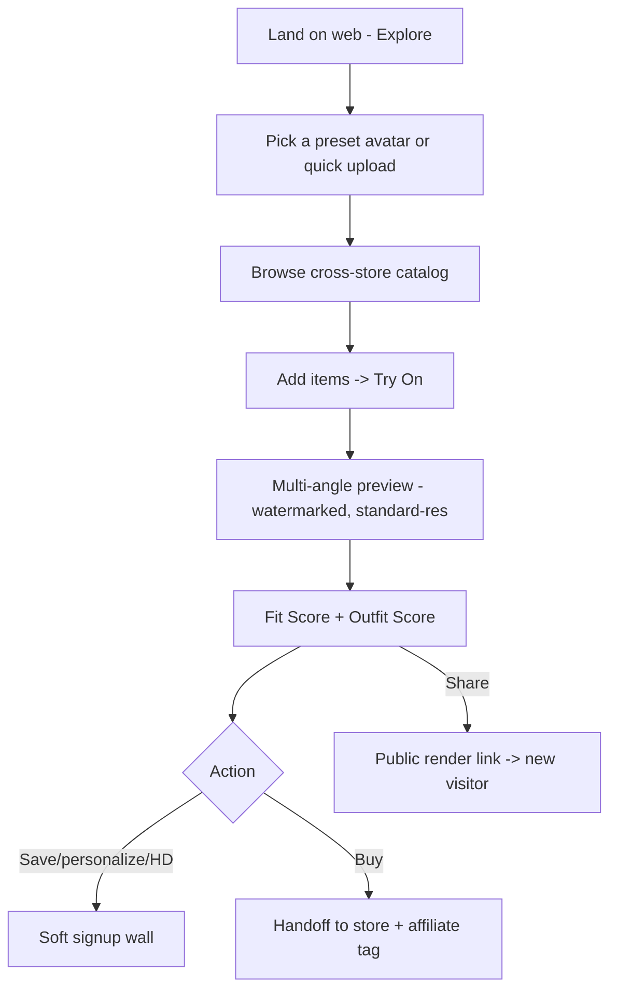

# Web App Specification

> The interactive browser surface. Its headline job is the **Guest "Explore" demo (no login)** for fast capture + **shareable-render landing** (virality) + desktop shoppers. Companion: `docs/guest-trial-strategy.md`, `docs/product-surfaces.md`.

## 1. Jobs
1. **Guest Explore** — try-on with a preset/demo avatar (or one throttled upload), no install, no login → the fast-capture funnel.
2. **Shared-render landing** — a shared "look" opens here → viewer + "make it you" signup prompt → viral loop.
3. **Signed-in web** — full try-on for desktop users (V2), same backend as mobile.

## 2. Scope by phase
| Phase | Web app scope |
|---|---|
| **MVP / early** | Guest Explore (preset avatar try-on + fit/outfit score, watermarked, capped) + share landing + handoff (affiliate) |
| **V2** | Signed-in: personalized avatar, save, HD, full parity where practical |

## 3. Tech recommendation
- **Option A (recommended for reuse): Flutter Web** — reuse the mobile codebase/components for the interactive app; one team, one logic layer.
- **Option B: React/Next.js client** — if web-specific UX/SEO for app pages matters more than code reuse.
- **Decision:** prototype Guest Explore in **Flutter Web** first (reuse the viewer); fall back to React if Flutter Web perf/SEO is insufficient for the guest funnel. Logged as an open decision.
- Shares the **same FastAPI backend + AI services** (`architecture/backend-architecture.md`) — no new backend.

## 4. Guest Explore flow (web)

## 5. Cost & revenue guardrails (inherited, mandatory)
- **Preset-avatar renders are cached/shared** across guests → cheap.
- Personalized avatar generation **gated behind lightweight signup** (protects unit economics).
- Guest **caps + bot/WAF protection** on render/upload endpoints (`compliance/security.md`).
- **Affiliate tags on all handoffs** — anonymous web users still earn commission.
- Full rationale: `docs/guest-trial-strategy.md`.

## 6. Shareable renders (viral loop)
- Each render/outfit gets a **public share URL** rendering the multi-angle viewer + "Try it on yourself" CTA.
- Watermarked; opens as a **new guest session** → capture funnel.
- Respect privacy: shared assets are the **outfit-on-demo/consented-avatar**, never someone's private body data without explicit share consent.

## 7. Accessibility & performance
- WCAG 2.2 AA (parity with app: textual fit narration, described viewer states).
- Fast on India mobile web (data-saver, lazy assets); responsive down to small screens.

## 8. What the web app does NOT do
- No store credential login. No cart injection. No un-throttled anonymous personalized-avatar generation. (Same red lines as the app.)

## 9. Success metrics
Guest-explore start → aha rate · guest → signup · guest → affiliate handoff · share → new-guest · **cost per guest session** (guardrail).
